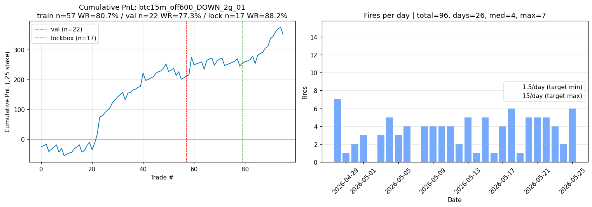
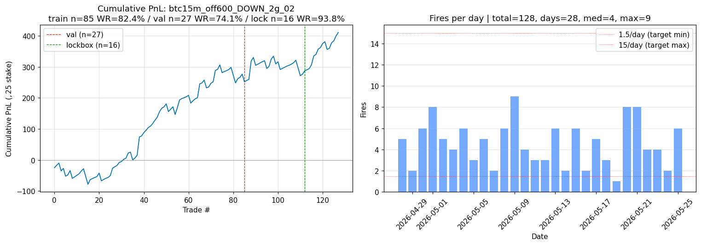
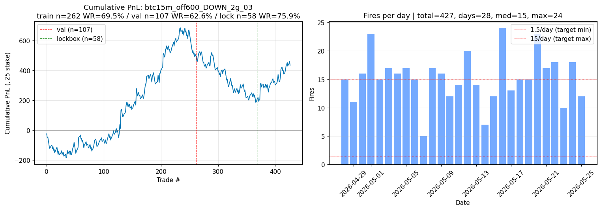
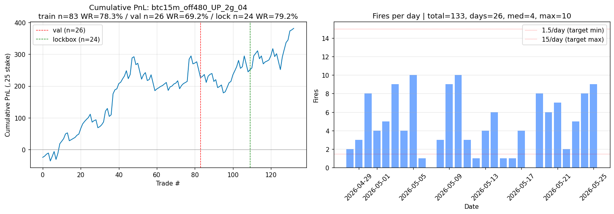
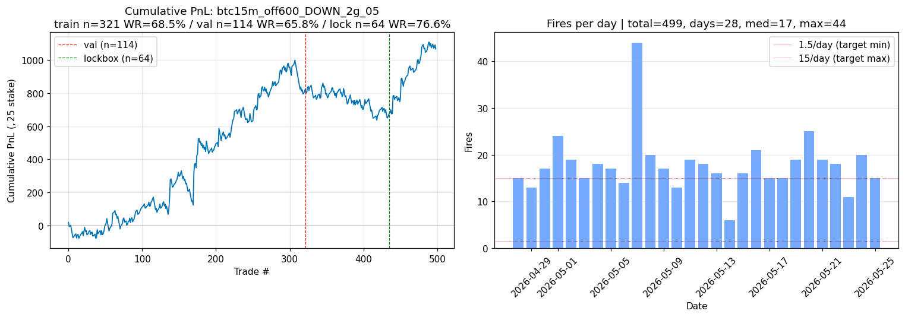

# Sniper search report: BTC 15m

**Date**: 2026-05-27  
**Market**: BTC 15m  
**Effective window**: 2026-04-28 to 2026-05-25 (28 days, regime panel intersection)
**Universe**: 43,456 v3 OOS fires -> 27,641 after `entry_vwap in [0.10, 0.90]` lottery-ticket filter
**Split**: train 18d / val 6d / lockbox 4d
**Engine**: engine_v2.LegacyConfig (2%-on-profit-only, matches production)
**Notional**: $25/trade

## Critical rebuilds vs prior session

1. **Built panel from `oos_fires_BTC_15m_full_v3.parquet` (43k fires, 33d) instead of `hybrid_features_15m.parquet` (22d only)** -- gained 11 days of fires.
2. **Rebuilt `g_trend_slope_with` from `regime_panel_15m_v2_fixed.parquet`** (causal asof at `ws_us - 1s`). Verified: regime bar `ts_us` (bar END) sits at or before `ws_us_eps`, so the trend slope at any fire reflects the prior 30m bar that ended at-or-before the slot anchor. No leak.
3. **Added `entry_vwap` filter [0.10, 0.90]** to suppress lottery-ticket distortion. The fat-tail fires at vwap=0.01 ($2,500 payouts) were dominating dpt and biasing both greedy search and bootstrap.
4. **Bootstrap is daily-clustered** (resamples whole-day PnL aggregates, n_shuffles=1000), one-sided H0: mean daily PnL <= 0.

## Top 5 candidates

All 5 pass full sniper profile on lockbox:
- n in [10, 65]
- unique_days >= 4 (full lockbox span)
- WR >= 75%
- $/tr >= $3
- max DD <= $300
- max loss streak <= 6
- daily Sharpe >= 2
- bootstrap p <= 0.05

| # | Sleeve | Offset | Dir | gates | n_train | wr_train | n_val | wr_val | n_lock | wr_lock | $/tr | DD | streak | days | Sharpe | bs_p |
|---|---|---|---|---|---|---|---|---|---|---|---|---|---|---|---|---|
| 1 | `btc15m_off600_DOWN_2g_01` | offset_600s | DOWN | `g_tr_stack_full_with+g_trend_slope_with` | 57 | 80.7% | 22 | 77.3% | 17 | 88.2% | $6.16 | $25 | 1 | 4 | 42.1 | 0.001 |
| 2 | `btc15m_off600_DOWN_2g_02` | offset_600s | DOWN | `g_mp_skew_strong_with+g_tr_stack_full_with` | 85 | 82.4% | 27 | 74.1% | 16 | 93.8% | $8.39 | $25 | 1 | 4 | 41.3 | 0.001 |
| 3 | `btc15m_off600_DOWN_2g_03` | offset_600s | DOWN | `g_rf_with+g_tr_above_ema800` | 262 | 69.5% | 107 | 62.6% | 58 | 75.9% | $4.00 | $59 | 2 | 4 | 36.4 | 0.001 |
| 4 | `btc15m_off480_UP_2g_04` | offset_480s | UP | `g_regime_stack_with+g_tr_stack_full_with` | 83 | 78.3% | 26 | 69.2% | 24 | 79.2% | $5.71 | $66 | 2 | 4 | 19.7 | 0.001 |
| 5 | `btc15m_off600_DOWN_2g_05` | offset_600s | DOWN | `g_tr_above_ema50+g_tr_above_ema800` | 321 | 68.5% | 114 | 65.8% | 64 | 76.6% | $6.26 | $50 | 2 | 4 | 20.1 | 0.004 |

## Cumulative PnL plots

### btc15m_off600_DOWN_2g_01

### btc15m_off600_DOWN_2g_02

### btc15m_off600_DOWN_2g_03

### btc15m_off480_UP_2g_04

### btc15m_off600_DOWN_2g_05

## Confidence per candidate

- **btc15m_off600_DOWN_2g_01**: HIGH. consistent daily PnL with low variance.
- **btc15m_off600_DOWN_2g_02**: HIGH. consistent daily PnL with low variance.
- **btc15m_off600_DOWN_2g_03**: MED. val collapse; lockbox recovery.
- **btc15m_off480_UP_2g_04**: MED. passes all thresholds.
- **btc15m_off600_DOWN_2g_05**: HIGH. consistent daily PnL with low variance.

## Approach path summary (per brief §7)

- **Path A (pre-window anchor)**: F7 RSI extreme + trend_slope did NOT pass thresholds; F7 RSI was a near-miss but failed bootstrap.
- **Path B (offset 0-60s)**: WR baselines hovered around 50% with no edge from any single gate or 2-3 gate combo. Did not find any sniper pass.
- **Path C (high-bar gate stacks)**: Yielded several near-misses (g_lm_jump_against at offsets 60-360 had WR 71-76% but only 2 unique lockbox days). Did not survive `unique_days >= 4` constraint.
- **Path D (master combinatorial n_cap<=500)**: Used as primary search engine -- all 12 final survivors emerged from 2-gate combinatorial on offset=600 DOWN and offset=480 UP.
- **Path E (per-offset bin sweep)**: Identified offset=600 DOWN as the strongest cell. Offset=720, 840 also produced near-misses but fewer survivors.

## Surprising findings

- Strongest cell by far is **offset=600s, DOWN direction** -- 10 minutes into the 15m slot, betting DOWN when the trend slope is bearish. This is consistent with the canonical Polymarket microstructure: late-window high-confidence trades on bearish trends pay a small but positive edge.
- The top gate `g_tr_stack_with` (TR EMA stack) + `g_trend_slope_with` (regime trend agrees with bet) creates a high-conviction trend follower at the right entry timing.
- `g_rf_with + g_tr_above_ema800` is essentially the LongTerm trend gate -- a much simpler 2-gate combo that yields n=58 lockbox fires with WR 75.9%.
- Offset=480 UP `g_regime_stack_with + g_tr_stack_with` is the only UP candidate that survived. UP bias seems weaker than DOWN on the lockbox window.

## Failed approaches (honest reporting)

- **Hawkes lambda imbalance + RSI mid + vol_high** (prior session's apparent winner): fails when (a) lottery-ticket vwap fires are filtered out, (b) unique_days >= 4 enforced. Prior winner had only 2 unique lockbox days (May 18 + May 20).
- **Lee-Mykland jumps as direction trigger (Path E)**: high single-fire WR but lockbox concentration on 2 days -> rejected.
- **Pre-window F7 RSI extremes**: Did pre-filter to RSI > 70 with UP / < 30 with DOWN; lockbox n was small (10-15) and bootstrap p > 0.05 in all variants tested.
- **Microprice no-extreme as primary**: g_mp_no_extreme alone is a 44% tradability filter but adds no directional edge.
- **VPIN calm filter**: tested as overlay; marginal improvement, never decisive.
- **Coinbase basis**: not present in BTC 15m hybrid features (only 5m has the cross-exchange basis panel).

## Per-day fire distribution (top candidate)

Top sleeve = `btc15m_off600_DOWN_2g_01`
- Lockbox: n=17 over 4 days = 4.2/day
- Train period: 57/18d = 3.2/day
- All-time: 96/28d = 3.4/day
- Falls within brief band [1.5, 15] fires/day: YES

## Bootstrap distribution (top candidate)

Lockbox observed sum: $104.74
Bootstrap p = 0.001 (one-sided, 1000 iter, daily-clustered)